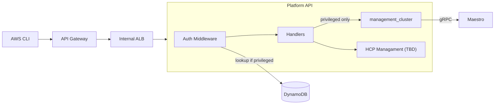

# ROSA Regional Platform API

Stateless gateway API for ROSA HCP regional cluster management.

## Architecture



## Endpoints

| Endpoint                               | Auth       | Description                                  |
| -------------------------------------- | ---------- | -------------------------------------------- |
| `POST /api/v0/management_clusters`     | privileged | Create management cluster (Maestro consumer) |
| `GET /api/v0/management_clusters`      | privileged | List management clusters                     |
| `GET /api/v0/management_clusters/{id}` | privileged | Get management cluster                       |

## Configuration

| Flag                | Default                  | Description     |
| ------------------- | ------------------------ | --------------- |
| `--api-port`        | 8000                     | API server port |
| `--maestro-url`     | `http://maestro:8000`    | Maestro API URL |
| `--dynamodb-table`  | `rosa-customer-accounts` | DynamoDB table  |
| `--dynamodb-region` | `us-east-1`              | AWS region      |

## Build

```bash
make build
make test
make image
```

## Testing

### Unit Tests

Run all unit tests (excludes e2e tests):
```bash
make test
```

Run tests for a specific package:
```bash
make test-unit PKG=./pkg/authz/...
```

Run authorization package tests only:
```bash
make test-authz
```

Generate coverage report:
```bash
make test-coverage
# Opens coverage.html in your browser
```

### E2E Tests
E2E tests use [Ginkgo](https://onsi.github.io/ginkgo/) and generate JUnit XML reports in `./test-results/junit.xml`.

#### Prerequisites
Set the following environment variables:
- `BASE_URL` - API Gateway URL (e.g., `https://xxxxx.execute-api.us-east-2.amazonaws.com/prod`)
- `E2E_ACCOUNT_ID` - AWS account ID for testing (optional, defaults to current AWS credentials)

#### Run E2E tests locally (Native)

The tests run natively on your platform (Linux, macOS, Windows).

**Prerequisites**: Install Ginkgo CLI
```bash
go install github.com/onsi/ginkgo/v2/ginkgo@latest
```

**Run tests:**
```bash
export BASE_URL="https://xxxxx.execute-api.us-east-2.amazonaws.com/prod"
export E2E_ACCOUNT_ID="123456789012"  # Optional
make test-e2e
```

Results are written to `./test-results/junit.xml`.

#### Run E2E tests in a container (Linux only)

This is useful for CI/CD pipelines or isolated test environments.

**Note**: Containers run Linux. You can **build** the container on macOS/Windows, but it runs Linux inside.

1. Build the e2e container:
```bash
# Single platform build (default: linux/amd64)
# Works on macOS (including M1/M2), Linux, Windows
make image-e2e

# Multi-architecture build (linux/amd64, linux/arm64)
# Requires Docker Buildx
make image-e2e-multiarch

# Build and push multi-architecture image to registry
make image-e2e-push-multiarch
```

You can customize the target platforms:
```bash
make image-e2e-multiarch PLATFORMS=linux/amd64,linux/arm64,linux/ppc64le
```

**Building on macOS (including Apple Silicon)**:
```bash
# On macOS M1/M2, build for linux/arm64 (faster)
make image-e2e GOOS=linux GOARCH=arm64

# Or build for linux/amd64 (cross-compile)
make image-e2e GOOS=linux GOARCH=amd64
```

2. Run tests in the container:
```bash
make test-e2e-container \
  BASE_URL="https://xxxxx.execute-api.us-east-2.amazonaws.com/prod" \
  E2E_ACCOUNT_ID="123456789012"
```

**With a specific AWS profile** (shares your `~/.aws` credentials):
```bash
make test-e2e-container \
  BASE_URL="https://xxxxx.execute-api.us-east-2.amazonaws.com/prod" \
  AWS_PROFILE="my-aws-profile" \
  AWS_REGION="us-east-2"
```

**Run specific tests with --focus**:
```bash
# Run only AWS Credentials Check test
make test-e2e-container \
  BASE_URL="https://xxxxx.execute-api.us-east-2.amazonaws.com/prod" \
  FOCUS="AWS Credentials"

# Run tests matching a pattern
make test-e2e-container \
  BASE_URL="https://xxxxx.execute-api.us-east-2.amazonaws.com/prod" \
  FOCUS="management cluster"
```

**Skip specific tests**:
```bash
# Skip authorization tests (default behavior)
make test-e2e-container \
  BASE_URL="https://xxxxx.execute-api.us-east-2.amazonaws.com/prod" \
  SKIP="Authz"

# Run all tests (override default skip)
make test-e2e-container \
  BASE_URL="https://xxxxx.execute-api.us-east-2.amazonaws.com/prod" \
  SKIP=""
```

The container automatically:
- Mounts your `~/.aws` directory (read-only) - includes both `credentials` and `config` files
- Passes the `AWS_PROFILE` environment variable
- Configures AWS SDK to load the profile

**Using credentials from a custom location**:
```bash
make test-e2e-container \
  BASE_URL="https://xxxxx.execute-api.us-east-2.amazonaws.com/prod" \
  AWS_CREDENTIALS_PATH="$(PWD)/../my-credentials-dir"
```

**Note**: The AWS SDK requires both `credentials` and `config` files for full profile support. If you only have a `credentials` file, make sure to:
- Set `AWS_ACCESS_KEY_ID` and `AWS_SECRET_ACCESS_KEY` directly, OR
- Ensure your credentials file contains all necessary settings

**Or use Docker/Podman directly**:

Standard approach (mounts entire `~/.aws` directory):
```bash
docker run --rm \
  -e E2E_BASE_URL="https://xxxxx.execute-api.us-east-2.amazonaws.com/prod" \
  -e E2E_ACCOUNT_ID="123456789012" \
  -e AWS_PROFILE="my-aws-profile" \
  -e AWS_REGION="us-east-2" \
  -e AWS_SDK_LOAD_CONFIG=1 \
  -v $(pwd)/test-results:/app/test-results \
  -v ~/.aws:/root/.aws:ro \
  quay.io/openshift-online/rosa-regional-platform-api-e2e:latest
```

With a custom credentials directory:
```bash
docker run --rm \
  -e E2E_BASE_URL="https://xxxxx.execute-api.us-east-2.amazonaws.com/prod" \
  -e AWS_PROFILE="my-profile" \
  -e AWS_REGION="us-east-2" \
  -e AWS_SDK_LOAD_CONFIG=1 \
  -v $(pwd)/test-results:/app/test-results \
  -v /path/to/custom/aws-dir:/root/.aws:ro \
  quay.io/openshift-online/rosa-regional-platform-api-e2e:latest
```

The JUnit XML results will be available in `./test-results/junit.xml` after the tests complete.

#### Common E2E Test Scenarios

**Local development on macOS/Linux** (fastest):
```bash
export BASE_URL="https://xxxxx.execute-api.us-east-2.amazonaws.com/prod"
export AWS_PROFILE="my-profile"
make test-e2e
```

**Testing with a specific AWS profile in a container**:
```bash
make test-e2e-container \
  BASE_URL="https://xxxxx.execute-api.us-east-2.amazonaws.com/prod" \
  AWS_PROFILE="staging-profile"
```

**Debug AWS credentials in container**:
```bash
make test-e2e-container \
  BASE_URL="https://xxxxx.execute-api.us-east-2.amazonaws.com/prod" \
  AWS_PROFILE="rrp-chris-regional_cluster" \
  FOCUS="AWS Credentials"
```

**Run specific test in container**:
```bash
make test-e2e-container \
  BASE_URL="https://xxxxx.execute-api.us-east-2.amazonaws.com/prod" \
  FOCUS="management cluster"
```

**CI/CD pipeline** (uses IAM role or instance profile):
```bash
# AWS credentials provided by CI environment
make test-e2e-container BASE_URL="${API_URL}"
```

**Using Podman instead of Docker**:
```bash
# Replace 'docker' with 'podman' in any command
podman run --rm \
  -e E2E_BASE_URL="https://xxxxx.execute-api.us-east-2.amazonaws.com/prod" \
  -e AWS_PROFILE="my-profile" \
  -e AWS_SDK_LOAD_CONFIG=1 \
  -v $(pwd)/test-results:/app/test-results \
  -v ~/.aws:/root/.aws:ro \
  quay.io/openshift-online/rosa-regional-platform-api-e2e:latest
```

#### Troubleshooting AWS Credentials

If e2e tests fail with authentication errors, the **AWS Credentials Check** test helps diagnose the issue:

```bash
# Quick check - run just the credentials verification test (native)
make test-e2e-awscreds

# Or in a container with focus on AWS credentials check
make test-e2e-container \
  BASE_URL="https://xxxxx.execute-api.us-east-2.amazonaws.com/prod" \
  FOCUS="AWS Credentials"
```

The test will show:
- ✓ Successfully validated credentials with your AWS account, ARN, and UserId
- ✗ Error message if credentials are missing or invalid

**Example output:**
```bash
✓ AWS Credentials verified successfully
  Account: 123456789012
  ARN: arn:aws:sts::123456789012:assumed-role/MyRole/session
  UserId: AROAEXAMPLEID:session
  Profile: rrp-chris-regional_cluster
  Region: us-east-2
```

Common issues:
- **"no such file or directory"**: AWS credentials file not mounted correctly
- **"Unable to locate credentials"**: `AWS_PROFILE` doesn't exist or credentials file is malformed
- **"ExpiredToken"**: Your AWS session token has expired (common with SSO)
- **"AccessDenied"**: Credentials work but lack permissions for STS GetCallerIdentity
- **"credential_process: exit status 127" or "uv: not found"**: Your AWS config uses `credential_process` with a tool not in the container

**Workaround for credential_process issues:**

If you get credential_process errors, use the static credentials target which automatically exports credentials from your profile:

```bash
# Automatically exports credentials from your profile and passes them to container
make test-e2e-container-static-creds \
  BASE_URL="https://xxxxx.execute-api.us-east-2.amazonaws.com/prod" \
  AWS_PROFILE="rrp-chris-regional_cluster"
```

This target:
1. Exports credentials from your profile using `aws configure export-credentials`
2. Passes them as environment variables (AWS_ACCESS_KEY_ID, AWS_SECRET_ACCESS_KEY, AWS_SESSION_TOKEN)
3. Avoids mounting credential files and running credential_process in the container

Or manually export credentials:
```bash
# Export your credentials directly (avoids credential_process)
export AWS_ACCESS_KEY_ID="your-access-key"
export AWS_SECRET_ACCESS_KEY="your-secret-key"
export AWS_SESSION_TOKEN="your-session-token"  # If using temporary credentials

# Run tests with environment credentials
make test-e2e-container BASE_URL="https://xxxxx.execute-api.us-east-2.amazonaws.com/prod"
```

Or, get temporary credentials from your credential process locally and pass them:
```bash
# Get credentials from your local credential process
aws configure export-credentials --profile rrp-chris-regional_cluster --format env

# Then use the output to set env vars and run without mounting credentials
docker run --rm \
  -e E2E_BASE_URL="https://xxxxx.execute-api.us-east-2.amazonaws.com/prod" \
  -e AWS_ACCESS_KEY_ID="..." \
  -e AWS_SECRET_ACCESS_KEY="..." \
  -e AWS_SESSION_TOKEN="..." \
  -e AWS_REGION="us-east-2" \
  -v $(pwd)/test-results:/app/test-results \
  quay.io/openshift-online/rosa-regional-platform-api-e2e:latest
```

**Debug credentials inside the container:**
```bash
# Drop into an interactive shell to troubleshoot
make debug-e2e-container-creds AWS_PROFILE="rrp-chris-regional_cluster"

# Inside the container, try:
# ls -la /root/.aws/
# cat /root/.aws/config
# env | grep AWS
# aws sts get-caller-identity --profile rrp-chris-regional_cluster
```

### Authorization E2E Tests

Authorization tests require local DynamoDB and cedar-agent infrastructure.

Start the infrastructure:
```bash
make e2e-authz-infra-up
```

Run authz e2e tests:
```bash
make test-e2e-authz
```

Stop the infrastructure:
```bash
make e2e-authz-infra-down
```

Or run everything with automatic cleanup:
```bash
make test-e2e-authz-clean
```

### Test Structure

```
test/
├── e2e/
│   ├── e2e_test.go              # Main e2e test suite
│   ├── awscreds_check_test.go   # AWS credentials verification tests
│   ├── authz_e2e_test.go        # Authorization e2e tests
│   ├── api_client.go            # Reusable API client with SigV4 auth
│   └── testdata_loader.go       # Test data utilities
```

### E2E Test Cases

The e2e suite includes several test categories:

1. **AWS Credentials Check** (`awscreds_check_test.go`)
   - Verifies AWS credentials are properly configured
   - Uses STS GetCallerIdentity to validate credentials
   - Reports AWS account, ARN, and profile information
   - Useful for debugging credential mounting in containers

2. **Platform API Tests** (`e2e_test.go`)
   - Tests API endpoints (`/live`, `/ready`, etc.)
   - Management cluster operations
   - ManifestWork creation and distribution

3. **Authorization Tests** (`authz_e2e_test.go`)
   - Tests Cedar-based authorization
   - Requires local DynamoDB and cedar-agent

### Writing E2E Tests

E2E tests use the shared `APIClient` for making authenticated requests to the API:

```go
It("should successfully call an endpoint", func() {
    response, err := apiClient.Get("/api/v0/ready", accountID)
    Expect(err).To(BeNil())
    Expect(response.StatusCode).To(Equal(http.StatusOK))
})
```

For POST requests:
```go
It("should create a resource", func() {
    payload := map[string]interface{}{
        "name": "test-resource",
        "labels": map[string]string{
            "key": "value",
        },
    }
    response, err := apiClient.Post("/api/v0/resource", payload, accountID)
    Expect(err).To(BeNil())
    Expect(response.StatusCode).To(Equal(http.StatusCreated))
})
```

## API Examples

### Register a new management cluster
```bash
awscurl -X POST https://z11111111.execute-api.us-east-2.amazonaws.com/prod/api/v0/management_clusters \
--service execute-api \
--region us-east-2 \
-H "Content-Type: application/json" \
-d '{"name": "management-01", "labels": {"cluster_type": "management", "cluster_id": "management-01"}}'
```

### Get the current resource bundles
```bash
awscurl https://z11111111.execute-api.us-east-2.amazonaws.com/prod/api/v0/resource_bundles \
--service execute-api \
--region us-east-2
```

### Create a manifestwork for management-01
```bash
# see swagger for reference for the payload struct
awscurl -X POST https://z11111111.execute-api.us-east-2.amazonaws.com/prod/api/v0/work \
--service execute-api \
--region us-east-2 \
-d @payload.json
```


